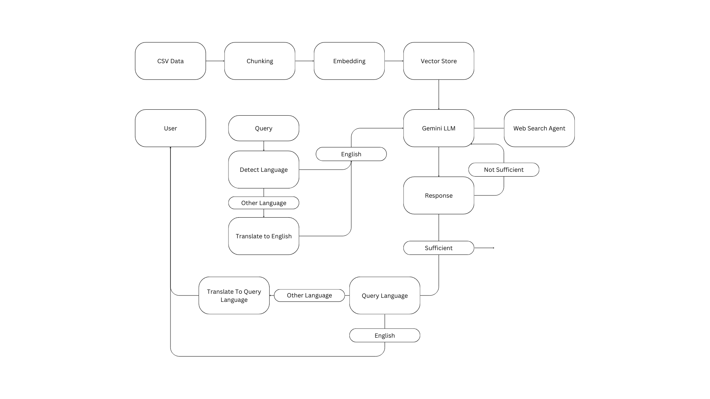

# Boss Wallah RAG Chatbot

A sophisticated RAG (Retrieval-Augmented Generation) based AI chatbot that acts as a support agent for Boss Wallah courses. The chatbot uses semantic search to find relevant courses and Google Gemini 2.5 Flash to generate contextual responses.

## 🚀 Features

- **Complete RAG Pipeline**: Implements all RAG components - data ingestion, embedding, retrieval, and generation
- **Semantic Search**: Uses sentence transformers and FAISS for accurate course retrieval
- **Multilingual Support**: Responds in Hindi, Tamil, Telugu, Kannada, Malayalam, and English
- **Google Gemini Integration**: Uses Gemini 2.5 Flash for high-quality response generation
- **Interactive UI**: Streamlit-based web interface for easy interaction
- **Comprehensive Testing**: Handles all required test cases including bonus tasks

## 📁 Project Structure

```
bosswallah_rag/
│
├── app.py
├── config.py
├── .env
├── data/
│   ├── bw_courses - Sheet1.csv
│   └── chroma_db/
│
├── core/
│   └── pipeline.py
│
├── src/
│   ├── rag/
│   │   ├── llm_setup.py
│   │   └── query_processor.py
│   ├── utils/
│   │   └── constants.py
│   ├── search/
│   │   └── google_search_service.py
│   ├── data_processing/
│   │   ├── data_loader.py
│   │   └── vectordb_creator.py
│   └── translation/
│       ├── language_detector.py
│       └── translator.py
│
├── ui/
│   ├── components/
│   │   ├── chat_interface.py
│   │   └── sidebar.py
│
└── test_search.py
```

## 🏗️ RAG Architecture

### 1. Data Ingestion (`data_loader.py`)
- Loads and preprocesses the course dataset
- Handles language code mapping (6→Hindi, 20→Tamil, etc.)
- Creates searchable text combining all course fields

### 2. Embedding & Indexing (`vector_store.py`)
- Uses `sentence-transformers/all-MiniLM-L6-v2` for embeddings
- Implements FAISS for efficient vector similarity search
- Supports different index types (flat, IVF, HNSW)

### 3. Retrieval System
- Semantic search using cosine similarity
- Configurable similarity threshold and top-k results
- Returns relevant courses with similarity scores

### 4. Generation (`llm_handler.py`)
- Integrates Google Gemini 2.5 Flash model
- Context-aware prompt engineering
- Multilingual response generation
- Safety settings and error handling

## Worflow Documentation

### Data Source Selection: Why CSV?
For this project, a CSV file was chosen as the primary data source for course information.

- Tabular Structure: The dataset is inherently tabular, making CSV the most natural and efficient format.
- Ease of Processing: CSV files are straightforward to parse, manipulate, and integrate into RAG pipelines compared to formats like PDF, which require complex extraction and may introduce errors.
- Performance: CSV enables fast loading and processing, which is crucial for real-time chatbot interactions.

### Data Preparation: Chunking and Embedding
- Chunking:
The course data is split into manageable text chunks. This ensures that each chunk contains coherent information and improves retrieval accuracy.
- Embedding:
Each chunk is converted into a vector representation using a sentence transformer model (all-MiniLM-L6-v2).
This allows for semantic similarity search between user queries and course content.
- Vector Store:
The Chroma vector database is used to store and retrieve embeddings.
Why Chroma?
Chroma is chosen for its speed, scalability, and seamless integration with popular embedding models and RAG frameworks.

### Language Detection and Translation
- Language Detection:
The langdetect library is used to automatically identify the language of each user query.
**Why langdetect?**
It is lightweight, fast, and provides reliable results for a wide range of languages.
- Translation:
The googletrans library is used to translate queries to English and responses back to the user’s language if needed.
**Why googletrans?**
It consistently delivers accurate translations and supports many languages.
The translate library was also evaluated but did not perform as well in this context.

### LLM Selection: Gemini
- Gemini LLM:
The Gemini large language model is used for generating responses.
**Why Gemini?**
Gemini is reliable, highly efficient, and offers a generous free tier, making it ideal for both development and production use


